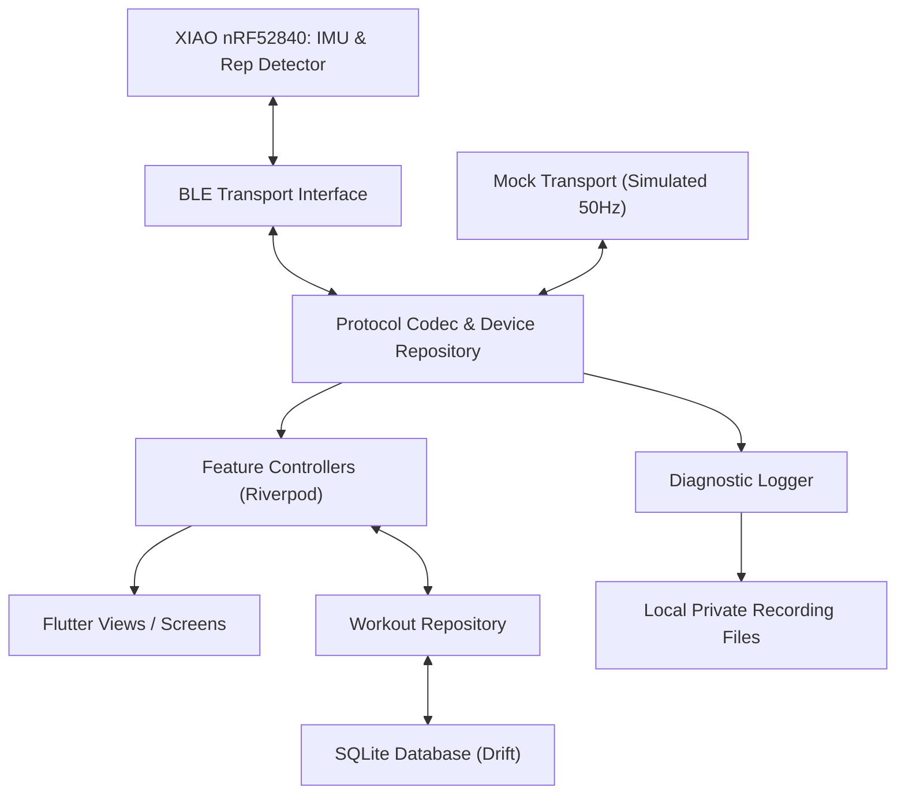

# Smart Tracker — Architecture Specification & Ownership Model

## 1. Runtime Architecture & Data Flow

## 2. Firmware vs. App Ownership Rules

1. **Rep Counter Ownership**:
   - **XIAO Firmware**: Owns sampling, IMU calibration status, selected rep algorithm profile, current set state, and authoritative cumulative rep counts.
   - **Flutter Mobile App**: Owns exercise labels, manual load input (kg/lb), set/workout grouping, user corrections, offline history, graphs, and CSV exports.
   - **CRITICAL**: Receipt of a motion packet in the app MUST NEVER increment the authoritative rep count.

2. **Set Lifecycle Separation**:
   - The device set lifecycle is lightweight (`START_SET`, `PAUSE_SET`, `RESUME_SET`, `END_SET`).
   - The app workout lifecycle can span multiple exercises and sets.

3. **Dependency Direction**:
   - `Presentation` $\rightarrow$ `Domain Contracts` $\leftarrow$ `Data Implementations`
   - Domain models contain zero Flutter UI widget dependencies or BLE plugin dependencies.

4. **Weight Conventions**:
   - Default for unilateral dumbbell exercises is **kg per dumbbell**.
   - Converted at display boundaries when `lb` is enabled. Never double values or assume bilateral loading.
